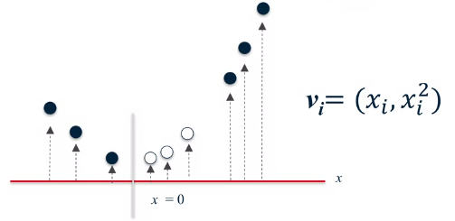

A simple problem that linear SVM fails to classify:

Transfer the data into a 2 dimensional space that is linearly separable:

And returning to the original space we will get the boundary that is non linear:

