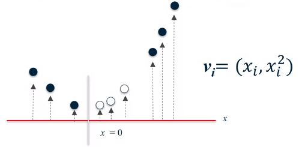
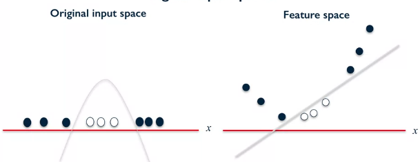
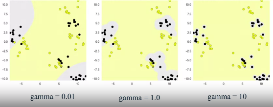
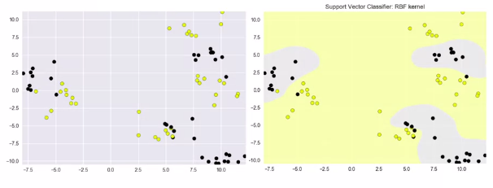

### Original Space
A simple problem that linear SVM fails to classify:

### Feature Space
Transfer the data into a 2 dimensional space that is linearly separable:

### Back to original space
And returning to the original space we will get the boundary that is non linear:

**Kernel** is a similiaryt measure.

## Different Kernels:
- [RBF](https://en.wikipedia.org/wiki/Radial_basis_function_kernel) (Radial Basis Function Kernel): hyperparameter is gamma, which determines the distance for points to be considered similar
- 
- Polynomial has a hypter parameters called degree

## Kernel Trick
Kernelized SVM doesn't need to transform data points. The dot product of pair of points is used in the cost function. This gets replaced buy the kernelized dot product.

- Example for RBF:

## CODE:
    from sklearn.svm import SVC
    SVC(
        kernel='poly|rbf', 
        degree=3,
        C=0.01
    ).fit(X_train, y_train)

## Note:
- Normalize your data before applying SVM
    - `from sklearn.preprocessing import MinMaxScaler`
    - `scaler = MinMaxScaler()`
    - `X_train_scaled = scaler.fit_transform(X_train)`
    - `X_test_scaled = scaler.transform(X_test)`
- Work well for low or high diminsional data
- Computational Time can grow fast
- No probability estimate is provided
- Difficult to interpret