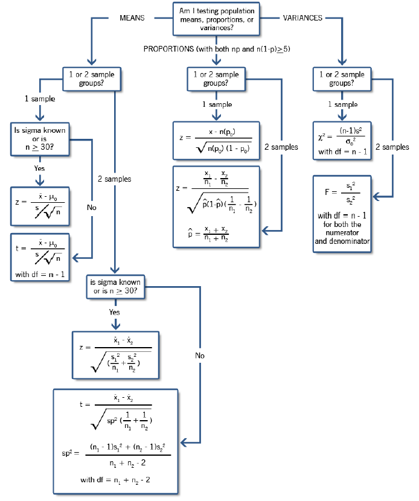
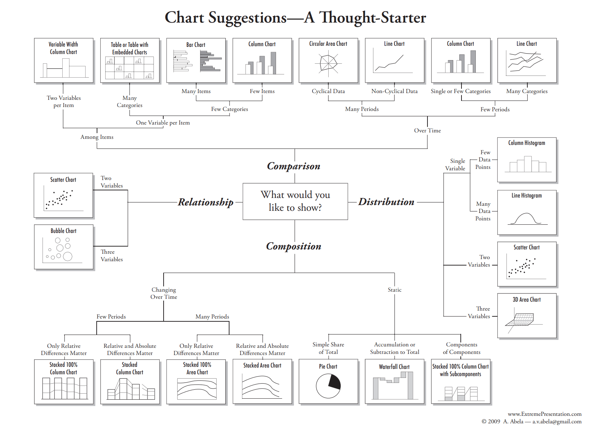

- [The most common statistical techniques used](http://www.statstutor.ac.uk/resources/uploaded/tutorsquickguidetostatistics.pdf)

- [Exploratory Data Analysis](https://www.itl.nist.gov/div898/handbook/eda/eda_d.htm)

- 
- 